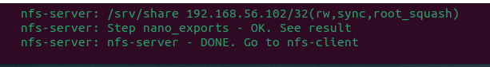
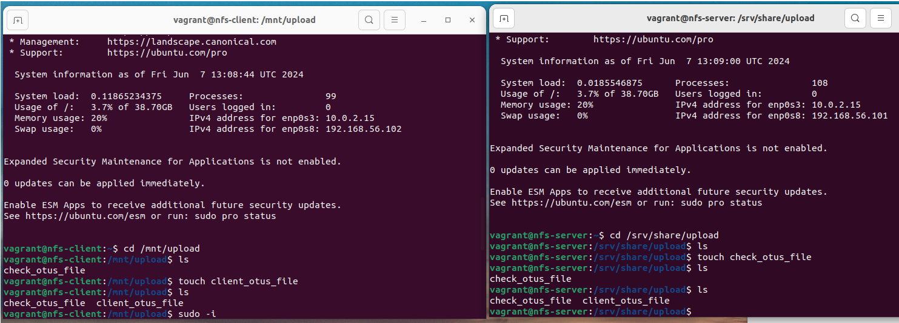

# homework-NFS

Описание домашнего задания
---
1. Научиться самостоятельно разворачивать сервис NFS и подключать к нему клиентов
2. vagrant up должен поднимать 2 настроенных виртуальных машины (сервер NFS и клиента) без дополнительных ручных действий

---
- Этап 1: Vagrantfile содержит в себе инструкции для создания 2х ВМ, которые потом настраиваются через provision.

Для выполнения этой части в Vagrantfile были добавлены строки для ВМ
```bash
box.vm.synced_folder ".", "/home/pt/vagrant/nfs"
```  
В этой директории лежат все скрипты, которые запускаются из секции "provision"
Все этапы разделены на разные скрипты, что позволяет быстрее вносить изменения (при необходимости), лучше заниматься отладной и использовать их для других целей, не выискивая строки среди общего кода. 

Так же в provision добавлены таймеры сна и сообщения о завершении конкретного этапа. Это дает время и возможность ознакомиться с результатом выполнения конкретного этапа настройки и найти этап, на котором может возникнуть ошибка

Все скрипты лежат в папке Scripts в этом репозитории

ОС для настройки: Ubuntu 24.04 (Для серверной и клиентской части) 

Vagrant версии 2.4.1

VirtualBox версии 7.0.18

---

- Этап 2: Настройка сервера NFS. (все скрины сделаны в момент выполнения секции provision, код - из скриптов)

● Устанавливаем сервер NFS:

```bash
apt install -y nfs-kernel-server
```  


● Проверяем наличие слушающих портов:
```bash
ss -tnplu
```  


ПРИМЕЧАНИЕ: среди вывода не был заметен порт 2049/udp. Однако, на просторах интернета было найдено следующее:
"UDP disabled for NFS mounts
Since Ubuntu 20.10 (“Groovy Gorilla”), the kernel option CONFIG_NFS_DISABLE_UDP_SUPPORT=y is set and this disables using UDP as the transport for NFS mounts, regardless of NFS version."

Из данного сообщения понятно, что начиная с 20 версии Ubuntu NFS не поддерживает протокол UDP. Скорее всего, именно поэтому мы не видим его в результате вывода команды

● Создаём и настраиваем директорию, которая будет экспортирована:
```bash
mkdir -p /srv/share/upload
chown -R nobody:nogroup /srv/share
chmod 0777 /srv/share/upload
ls -la /srv/share/upload
```


● Cоздаём в файле /etc/exports структуру, которая позволит экспортировать ранее созданную директорию, экспортируем директорию и проверяем, в том числе смотрим, записалось ли в файл то, что нам требуется:
```bash
echo "/srv/share 192.168.56.102/32(rw,sync,root_squash)" >> "/etc/exports"
exportfs -r
exportfs -s
cat /etc/exports
```


● Серверная часть настроилась:



---

- Этап 3: Настройка клиента NFS. (все скрины сделаны в момент выполнения секции provision, код - из скриптов)

● Устанавливаем пакет с NFS-клиентом:

```bash
apt install -y nfs-common
```


● Добавляем строку в /etc/fstab, после чего рестартим демон и сервисы и проверяем результат:
```bash
echo "192.168.56.101:/srv/share/ /mnt nfs vers=3,noauto,x-systemd.automount 0 0" >> "/etc/fstab"
systemctl daemon-reload
sleep 5
systemctl restart remote-fs.target
sleep 7
cd /mnt/
mount | grep mnt
```


---
- Этап 3: Проверяем работоспособность.

1. Заходим на сервер. 
2. Заходим в каталог /srv/share/upload.
3. Создаём тестовый файл touch check_otus_file.
4. Заходим на клиент.
5. Заходим в каталог /mnt/upload. 
6. Проверяем наличие ранее созданного файла.
7. Создаём тестовый файл touch client_otus_file. 
8. Проверяем, что файл успешно создан.




1. Перезагружаем клиент;
2. Заходим на клиент;
3. Заходим в каталог /mnt/upload;
4. Проверяем наличие ранее созданных файлов.


1. Заходим на сервер в отдельном окне терминала;
2. Перезагружаем сервер;
3. Заходим на сервер;
4. Проверяем наличие файлов в каталоге /srv/share/upload/;
5. Проверяем экспорты exportfs -s;
6. Проверяем работу RPC showmount -a 192.168.56.101.


1. Возвращаемся на клиент;
2. Перезагружаем клиент;
3. Заходим на клиент;
4. Проверяем работу RPC showmount -a 192.168.56.101;
5. Заходим в каталог /mnt/upload;
6. Проверяем статус монтирования mount | grep mnt;
7. Проверяем наличие ранее созданных файлов;
8. Создаём тестовый файл touch final_otus_check;
9. Проверяем, что файл успешно создан.


